# Bitemporal Tutorial

Authors: Hettie Dombrovskaya & Braviant Holdings

## Overview

Let’s quickly review bitemporal concepts. Terminology: 

- effective time
- asserted time 
- the combination of effective and asserted times: time regions

Why we need two time dimensions? 

## Bitemporal operations

Operations:
- create bitemporal table
- bitemporal insert
- bitemporal update
- bitemporal correction
- inactivate
- bitemporal delete

## Bitemporal Insert

now = 2015-05-01

```sql
select ll_bitemporal_insert(
'customers’,
, $$’customer_no’, name', ’type' $$,
, $$'C100','John Doe', 'Silver' $$,
 timeperiod('2015-06-01','infinity'), 
timeperiod('2015-05-01','infinity')
```


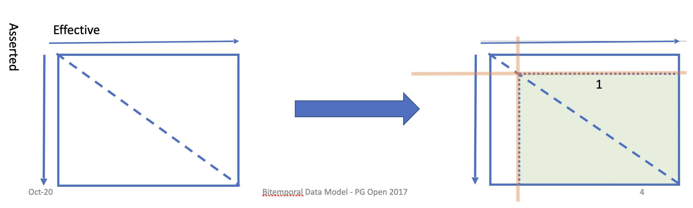

## Bitemporal Update

now = 2015-09-15

```sql
select ll_bitemporal_update($$customers$$,
$$customer_no$$, $$100$$, 
$$type$$, $$Gold$$,
timeperiod(‘2015-09-15’, ‘infinity’), 
timeperiod(‘2015-09-15’, ‘infinity’))
```
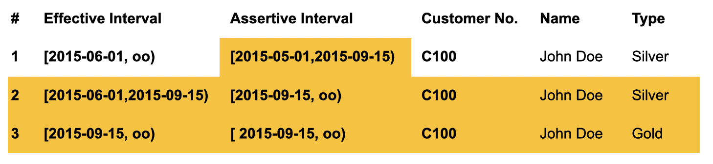

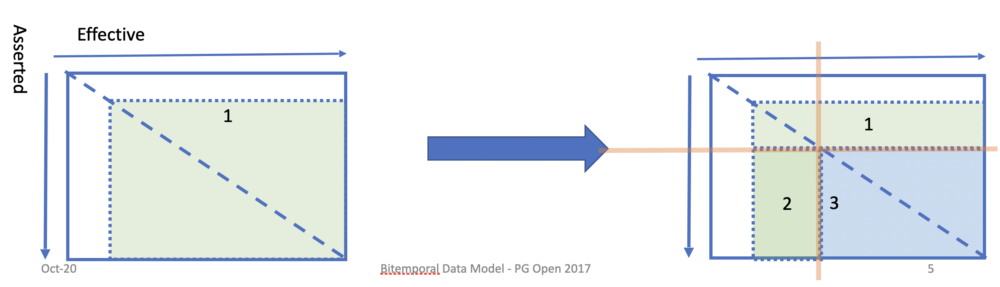

## Bitemporal Correction

now = 2015-09-15

```sql
select ll_bitemporal_correction($$customers$$,
$$type $$,
$$ Platinum$$,
$$ customer_no $$,
$$ C100$$,
timeperiod('2015-09-15','infinity'),
now())
```

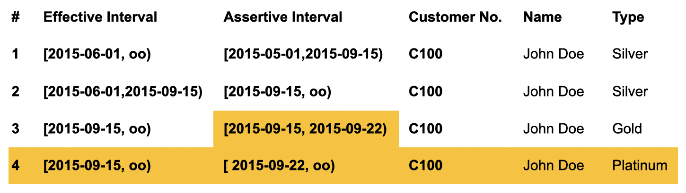

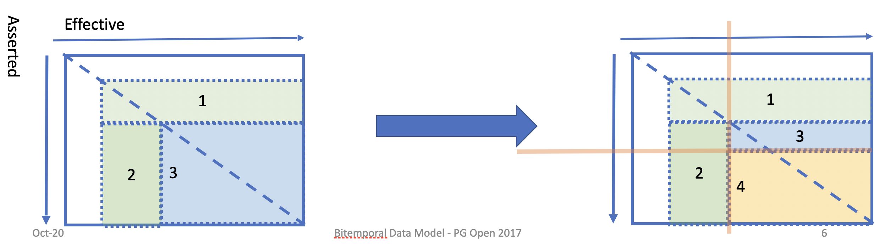

## Example – Courtesy of albert-kam

### Create tables

```sql
CREATE TABLE staff
	(staff_id int GENERATED BY DEFAULT AS
                    IDENTITY PRIMARY KEY, 
	  name TEXT NOT NULL,
      location TEXT NOT NULL,
	  created_at TIMESTAMPTZ NOT NULL DEFAULT NOW());
```

```sql
CREATE TABLE cust
	(cust_id int GENERATED BY DEFAULT AS
                    IDENTITY PRIMARY KEY, 
	  cust_name TEXT NOT NULL,
      phone TEXT,
	  created_at TIMESTAMPTZ NOT NULL 
                        DEFAULT NOW());
```

```sql
CREATE TABLE product
	(product_id INT GENERATED BY DEFAULT AS
                IDENTITY PRIMARY KEY, 
	  product_name text NOT NULL,
      weight INTEGER NOT NULL DEFAULT(0),
      price INTEGER NOT NULL DEFAULT(0),
      deleted BOOLEAN NOT NULL DEFAULT(FALSE),
	  created_at TIMESTAMPTZ NOT NULL DEFAULT NOW());
```

```sql
CREATE TABLE t_order
	(order_id INT GENERATED BY DEFAULT AS IDENTITY
                                           PRIMARY KEY, 
	staff_id INT NOT NULL REFERENCES staff(staff_id),
     cust_id INT NOT NULL REFERENCES cust(cust_id),
	created_at TIMESTAMPTZ NOT NULL DEFAULT NOW());
---

CREATE TABLE t_order_line
	(order_line_id INT GENERATED BY DEFAULT AS IDENTITY 
                                 PRIMARY KEY, 
       order_id INT REFERENCES t_order(order_id),
	  product_id INT REFERENCES product(product_id),
       qty INTEGER NOT NULL,
	  created_at TIMESTAMPTZ NOT NULL DEFAULT NOW());
```

### Populate tables

```sql
INSERT INTO cust (cust_name, phone) VALUES ('mycust’,
 '+6281197889890’);

INSERT INTO staff (name, location) VALUES ('mystaff’,
 'mylocation’);

INSERT INTO product (product_name, weight, price) VALUES
 ('myproduct2', 200, 100);

INSERT INTO t_order (staff_id, cust_id) VALUES (1, 1);

INSERT INTO t_order_line (order_id, product_id, qty) 
VALUES (1, 1, 10);
```

### Read data

```sql
SELECT o.order_id, 
s.name AS staff_name, 
s.location AS staff_loc, 
c.cust_name, 
c.phone AS cust_phone, 
p.product_name, 
p.price,
l.qty
    FROM t_order_line l
    JOIN t_order o ON o.order_id = l.order_id
    JOIN product p ON p.product_id = l.product_id
    JOIN staff s ON s.staff_id = o.staff_id
    JOIN cust c ON c.cust_id = o.cust_id;
```

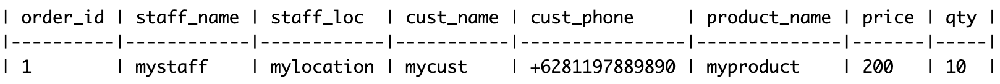

### Performing regular updates – incorrect result

```sql
UPDATE staff SET location = 'newlocation' WHERE staff_id = 1;
UPDATE cust SET phone = '+6281111111111' WHERE cust_id = 1;
UPDATE product SET price = 300 WHERE product_id = 1;
```

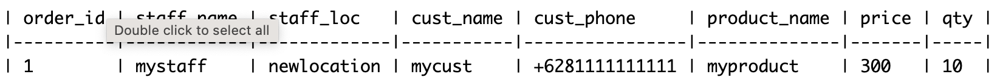

## Bitemporal Solution

### Create bitemporal tables

```sql
SELECT * FROM
 bitemporal_internal.ll_create_bitemporal_table(
    'bt_tutorial',
    'staff_bt',
	$$staff_id int, 
	 staff_name TEXT NOT NULL,
      staff_location TEXT NOT NULL
	$$,
   'staff_id’);
```
returns `true` or `false`, errors are included into messages.

### How bitemporal table looks

```sql
CREATE TABLE bt_tutorial.staff_bt
( staff_bt_key integer NOT NULL DEFAULT
            nextval('bt_tutorial.staff_bt_staff_bt_key_seq'::regclass),
    staff_id integer,
    staff_name text NOT NULL,
    staff_location text NOT NULL,
    effective temporal_relationships.timeperiod,
    asserted temporal_relationships.timeperiod,
    row_created_at timestamp with time zone NOT NULL DEFAULT now(),
    CONSTRAINT staff_bt_pk PRIMARY KEY (staff_bt_key),
    CONSTRAINT staff_bt_staff_id_assert_eff_excl EXCLUDE USING gist (
        effective WITH &&,
        asserted WITH &&,
        staff_id WITH =)
);
```

```sql
SELECT * FROM bitemporal_internal.ll_create_bitemporal_table(
    'bt_tutorial',
    'cust_bt',
	$$cust_id int NOT NULL, 
	   cust_name TEXT NOT NULL,
                   phone TEXT$$,
   'cust_id’);
---
SELECT * FROM bitemporal_internal.ll_create_bitemporal_table(
    'bt_tutorial',
    'product_bt',
	$$product_id INT,
	  product_name text NOT NULL,
                  weight INTEGER NOT NULL DEFAULT(0),
                  price INTEGER NOT NULL DEFAULT(0)$$,
   'product_id');
```

```sql
SELECT * FROM bitemporal_internal.ll_create_bitemporal_table(
    'bt_tutorial',
    'order_bt',
	$$order_id INT NOT NULL,
	  staff_id INT NOT NULL,
           cust_id INT NOT NULL,
	  order_created_at timestamptz
	$$,
   'order_id’);

SELECT * FROM bitemporal_internal.ll_create_bitemporal_table(
    'bt_tutorial',
    'order_line_bt',
	$$order_line_id INT NOT NULL,
	 order_id INT NOT NULL,
          product_id INT NOT NULL,
	 qty int NOT NULL,
          order_line_created_at timestamptz
	$$,
   ‘order_id,order_line_id');
```

**Business key is not a primary key!**

```sql
drop SEQUENCE if exists bt_tutorial.staff_id_seq;
CREATE SEQUENCE bt_tutorial.staff_id_seq;

drop SEQUENCE if exists bt_tutorial.cust_id_seq;
CREATE SEQUENCE bt_tutorial.cust_id_seq;

drop SEQUENCE if exists bt_tutorial.product_id_seq;
CREATE SEQUENCE bt_tutorial.product_id_seq;

drop SEQUENCE if exists bt_tutorial.order_id_seq;
CREATE SEQUENCE bt_tutorial.order_id_seq;

drop SEQUENCE if exists bt_tutorial.order_line_id_seq;
CREATE SEQUENCE bt_tutorial.order_line_id_seq;
```

### Bitemporal inserts

```sql
select * from bitemporal_internal.ll_bitemporal_insert(
'bt_tutorial.staff_bt'
,$$staff_id, staff_name, staff_location$$
,quote_literal(nextval('staff_id_seq'))||$$,
'mystaff', 'mylocation'$$
,temporal_relationships.timeperiod(now(), 'infinity') --effective
,temporal_relationships.timeperiod(now(), 'infinity') --asserted
);
```

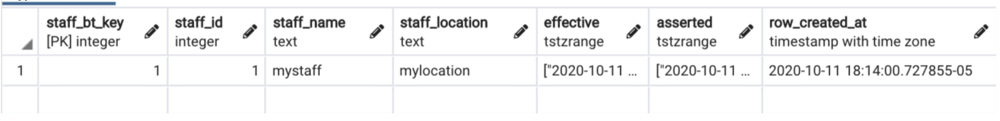

```sql
select * from bitemporal_internal.ll_bitemporal_insert('bt_tutorial.cust_bt'
,$$cust_id, cust_name, phone$$
,quote_literal(nextval('cust_id_seq'))||$$,
'mycust', '+6281197889890'$$
,temporal_relationships.timeperiod(now(), 'infinity')
,temporal_relationships.timeperiod(now(), 'infinity')
);

select * from bitemporal_internal.ll_bitemporal_insert('bt_tutorial.product_bt'
,$$product_id, product_name,weight,price$$
,quote_literal(nextval('product_id_seq'))||$$,
'myproduct', 100,200$$
,temporal_relationships.timeperiod(now(), 'infinity’),
,temporal_relationships.timeperiod(now(), 'infinity')
);

select * from bitemporal_internal.ll_bitemporal_insert('bt_tutorial.product_bt'
,$$product_id, product_name,weight,price$$
,quote_literal(nextval('product_id_seq'))||$$,
'myproduct2', 200,250$$
,temporal_relationships.timeperiod(now(), 'infinity') --effective
,temporal_relationships.timeperiod(now(), 'infinity') --asserted
);
```

```sql

ORDER:

select * from bitemporal_internal.ll_bitemporal_insert('bt_tutorial.order_bt'
,$$order_id, staff_id,cust_id,order_created_at$$
,quote_literal(nextval('order_id_seq'))||$$,
1,1,$$||quote_literal(now())
,temporal_relationships.timeperiod(now(), 'infinity')
,temporal_relationships.timeperiod(now(), 'infinity’));
```

```sql
ORDER LINES

select * from bitemporal_internal.ll_bitemporal_insert('bt_tutorial.order_line_bt'
,$$order_line_id,order_id, product_id,qty, order_line_created_at$$
,quote_literal(nextval('order_line_id_seq'))||$$,
1,1,10 ,$$||quote_literal(now())
,temporal_relationships.timeperiod(now(), 'infinity')
,temporal_relationships.timeperiod(now(), 'infinity'));

select * from bitemporal_internal.ll_bitemporal_insert('bt_tutorial.order_line_bt'
,$$order_line_id,order_id, product_id,qty$$
,quote_literal(nextval('order_line_id_seq'))||$$,
1,2,15 ,$$||quote_literal(now())
,temporal_relationships.timeperiod(now(), 'infinity')
,temporal_relationships.timeperiod(now(), 'infinity’));
```

### order_line_bt table

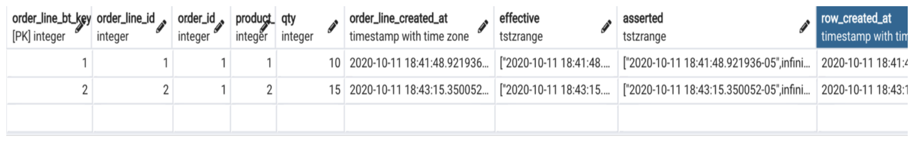

### Bitemporal SELECT

```sql
SELECT o.order_id, 
staff_name, 
staff_location, 
c.cust_name, 
c.phone AS cust_phone, 
p.product_name, 
p.price,
l.qty
    FROM order_line_bt l
    JOIN order_bt o ON o.order_id = l.order_id
    JOIN product_bt p ON p.product_id = l.product_id
    JOIN staff_bt s ON s.staff_id = o.staff_id
    JOIN cust_bt c ON c.cust_id = o.cust_id
WHERE now()<@l.effective AND now()<@l.asserted
AND now()<@o.effective AND now()<@o.asserted
AND now()<@c.effective AND now()<@c.asserted
AND now()<@p.effective AND now()<@p.asserted
AND now()<@s.effective AND now()<@s.asserted
```

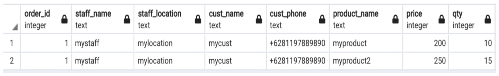

### Bitemportal update

```sql
SELECT * FROM  bitemporal_internal.ll_bitemporal_update('bt_tutorial'
,'staff_bt'
,'staff_location’  -- fields to update
,$$'newlocation'$$  -- values to update with
,'staff_id'  -- search fields
,'1' --  search values
,temporal_relationships.timeperiod(now(),'infinity’)
,temporal_relationships.timeperiod(now(),'infinity’));
```

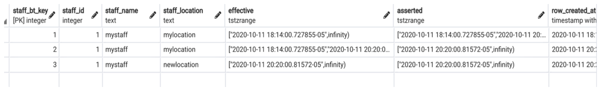

```sql
SELECT * FROM  bitemporal_internal.ll_bitemporal_update('bt_tutorial'
,'product_bt'
,'price'
,$$300$$
,'product_id'
,'1’
,temporal_relationships.timeperiod(now(), 'infinity')
,temporal_relationships.timeperiod(now(), 'infinity’)) ;

SELECT * FROM  bitemporal_internal.ll_bitemporal_update('bt_tutorial'
,'cust_bt'
,'phone'
,$$'+628111111111'$$
,'cust_id'  -- search fields
,$$1$$ --  search values
,temporal_relationships.timeperiod(now(), 'infinity')
,temporal_relationships.timeperiod(now(), 'infinity')) 
```

### SELECT at the time of order

```sql
SELECT  o.order_id,  staff_name,  staff_location, c.cust_name,  c.phone AS cust_phone, 
p.product_name,  p.price, l.qty
    FROM order_line_bt l
    JOIN order_bt o ON o.order_id = l.order_id
    JOIN product_bt p ON p.product_id = l.product_id
    JOIN staff_bt s ON s.staff_id = o.staff_id
    JOIN cust_bt c ON c.cust_id = o.cust_id
WHERE l.order_id=1
AND order_line_created_at<@l.effective AND now()<@l.asserted
AND order_created_at<@o.effective AND now()<@o.asserted
AND order_created_at<@c.effective AND now()<@c.asserted
AND order_created_at<@p.effective AND now()<@p.asserted
AND order_created_at<@s.effective AND now()<@s.asserted
```


### Bitemporal correction

```sql
SELECT * FROM
 bitemporal_internal.ll_bitemporal_correction(
     'bt_tutorial',
	'product_bt',
     'price',
     '275',
     'product_id',
     '2',
    temporal_relationships.timeperiod
    ('2020-10-11 18:33:26.816311-05'::timestamptz,
        'infinity'),
    now());
```

### SELECT at the time of order

```sql
SELECT  o.order_id,  staff_name,  staff_location, c.cust_name,  c.phone AS cust_phone, 
p.product_name,  p.price, l.qty
    FROM order_line_bt l
    JOIN order_bt o ON o.order_id = l.order_id
    JOIN product_bt p ON p.product_id = l.product_id
    JOIN staff_bt s ON s.staff_id = o.staff_id
    JOIN cust_bt c ON c.cust_id = o.cust_id
WHERE l.order_id=1
AND order_line_created_at<@l.effective AND now()<@l.asserted
AND order_created_at<@o.effective AND now()<@o.asserted
AND order_created_at<@c.effective AND now()<@c.asserted
AND order_created_at<@p.effective AND now()<@p.asserted
AND order_created_at<@s.effective AND now()<@s.asserted
```

### Results are corrected

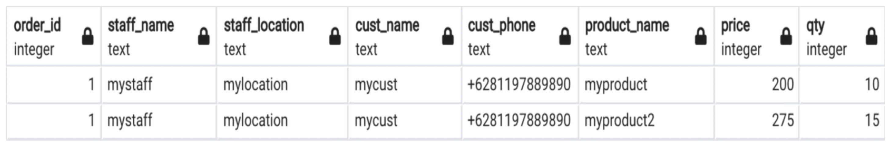

### SELECT with assertion at the time of order

```sql
SELECT  o.order_id,  staff_name,  staff_location, c.cust_name,  c.phone AS cust_phone, 
p.product_name,  p.price, l.qty
    FROM order_line_bt l
    JOIN order_bt o ON o.order_id = l.order_id
    JOIN product_bt p ON p.product_id = l.product_id
    JOIN staff_bt s ON s.staff_id = o.staff_id
    JOIN cust_bt c ON c.cust_id = o.cust_id
WHERE l.order_id=1
AND order_line_created_at<@l.effective 
AND order_line_created_at<@l.asserted
AND order_created_at<@o.effective AND order_created_at<@o.asserted
AND order_created_at<@c.effective AND order_created_at<@c.asserted
AND order_created_at<@p.effective AND order_created_at<@p.asserted
AND order_created_at<@s.effective AND order_created_at<@s.asserted
```

### Result at the time of order

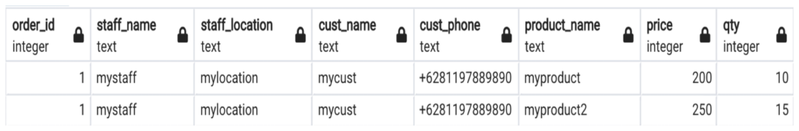

### Table product_dt

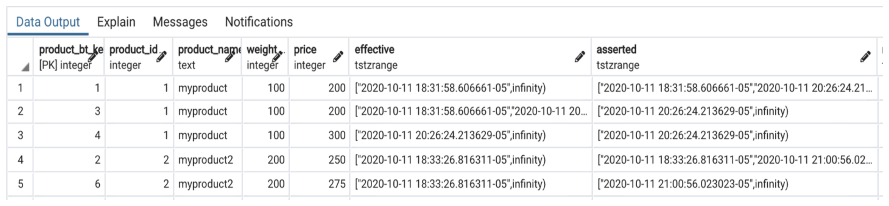